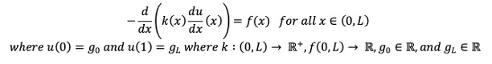

# Introduction to Finite Elements Methods - 1D FEM Solver

## How to run the code

An example usage logic has been defined in Grinsteins_MiniProject_DriverScript.m script. However, for general usage of the code, you can follow this example:

Let's say you need to solve a one-dimensional partial differential equation with the following form:

Here g_0 and g_L are boundary conditions for the problem and L is the length of your 1D domain. Furthermore, k(x) and f(x) can be constants or functions provided in your problem statement. For this example, assume g_0 = 10, g_L = 30, L = 100, k(x) = 2x, and f(x) = x^2.

This given values sets more than half of the One_dim_model_problem function (which is the engine of this code). You, as the user of this function, need to define the number of elements (n_el) and the polynomial degree for the approximation (k). Note here that the higher number of elements better approximates the solution and the higher polynomial degree the faster the solution converges to an answer. Just keep in mind that there are caveats with these parameters and higher values does not always mean better.

Suppose we pick 30 elements with k = 2 then you can call the One_Dim_Model_Problem the following way:

[x,d] = One_Dim_Model_Problem(2,30,2x,x^2,10,30,100)

This call will return two vectors with the same length x and d. The vector x represents points in the domain from 0 to L (inclusive). The size of x is dependent on the number of elements and the k polynomial value. The vector d represents solutions from the 1D finite element approximation at each value of x.

From these results you can validate the solution by comparing it to the true solution, graph your results, plot errors, etc…

Enjoy!

